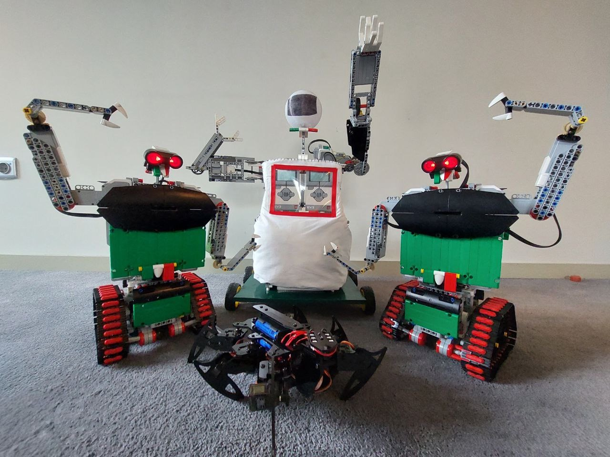
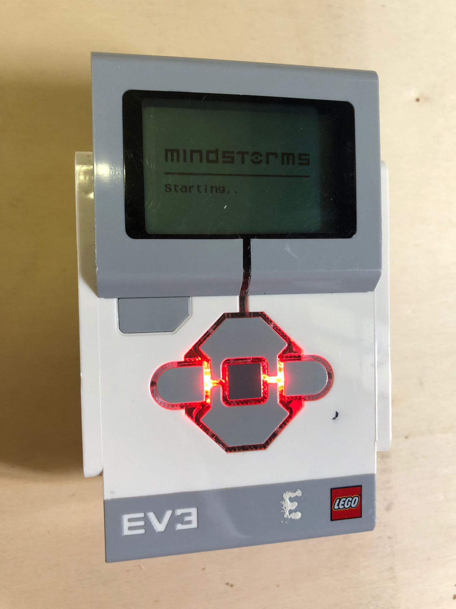
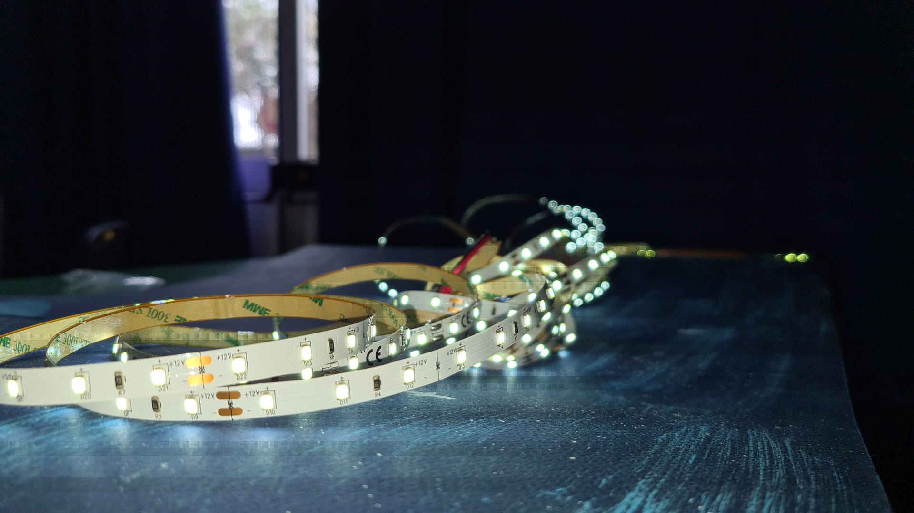

# Dancing in Space
This is the main documentation resource of the project that won first place in the European RoboCup OnStage competition held on 4th June 2022 in Guimares, Portugal  **🥇**
 
We realised four robots: 
1) a spiderish one
2) 2 medium-size ones
3) a bigger one
All of them who dance together.

Our performance consisted of two songs:"Also sprach Zarathustra" by Richard Strauss and "We will rock you" by Queen. The robots created an engaging atmosphere, syncronized with each other by Lego Bluetooth.

We added a led strip that will accompany the whole choreography in time with music. Lights simulated constellations with a simple switch on-off. Subsequently, we attached LEDs behind a billboard as a background for the show. This playbill represents space, full of stars and planets.

